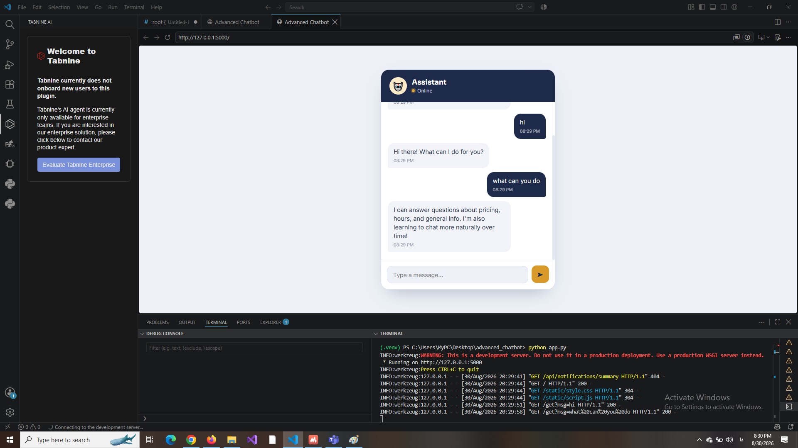
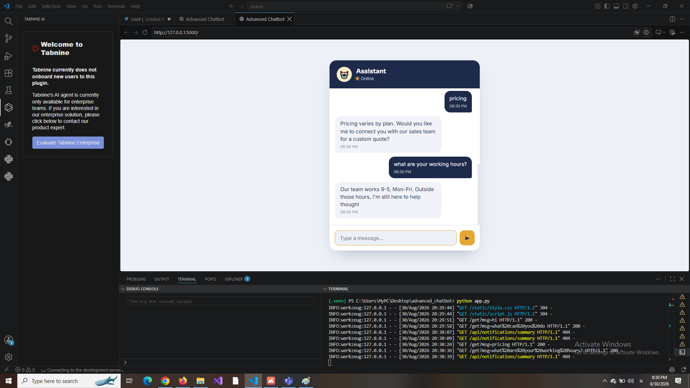

# Advanced Chatbot

A lightweight, bilingual chatbot built with Flask.

It is a rule-based conversational chatbot with a custom intent matching system. It can understand different ways of asking the same question, handle minor typos, and maintain a brief conversation history for each user.

The goal of this project was to understand how chatbot systems work by building the matching logic instead of relying on external APIs.

## Live Demo

You can try the chatbot here:

https://advanced-chatbot-16cy.onrender.com

The first request may take around 30 seconds because the free Render instance needs to wake up after inactivity.

## Screenshots

Chat interface:



### Example conversation:


### Intent matching example:



## Project Overview

The chatbot receives a user message, compares it with predefined intents, selects the closest match, and returns an appropriate response.

The first version of this project used simple matching, but it quickly became clear that users do not always ask questions in exactly the same way.

For example:

"What is the price?"

"How much does it cost?"

Both questions should elicit the same response.

To achieve this, I enhanced the matching system by incorporating various techniques, including substring matching, token overlap, and fuzzy similarity.

## Features

Custom Intent Matching

The chatbot uses a custom matching system written in Python.

It combines:

- Exact phrase matching
- Token overlap scoring
- Fuzzy similarity matching using Python's difflib.

This allows the chatbot to recognize different versions of similar questions.

Conversation context:

The application uses Flask sessions to keep a small amount of conversation state.

Each user has a separate session, so conversations do not interfere with each other.

Bilingual Support:

The chatbot supports English and Persian messages and responds in the same language.

### Web Chat Interface

The project includes a simple chat interface with message bubbles.

- Message bubbles
- User and bot avatars
- Timestamps
- A typing indicator
- Responsive layout

## How the Matching Works

For every incoming message, the chatbot calculates a score based on available patterns.

The scoring process includes:

1. Substring matching: Checks if a known phrase exists in the user's message.

2. Token Overlap: Compares shared words between the user's message and known patterns.

3. Fuzzy Similarity: Uses the difflib.SequenceMatcher class to detect similar phrases and minor typos.

The chatbot selects the intent with the highest score. If no intent receives a reliable score, the chatbot returns a fallback response.

## Challenges and Solutions

False Matches with Short or Common Words

After adding fuzzy matching, I noticed something strange. Very short inputs, such as "hi," "ok," or "no," (as well as similarly short Persian words) would sometimes match the wrong intent. Due to substring overlap and character-level similarity, short words received an unrealistically high score against patterns with which they had little in common.

I fixed this by making the scoring stricter for short inputs so that fuzzy similarity alone could no longer be enough to select an intent.

### Getting deployment right

The app ran fine locally, but preparing it for production required some adjustments. I had to go through the Flask setup, requirements, and the run command to ensure that everything matched what Render expected. Most of this involved carefully reading through the configurations rather than fixing a single bug. After a few rounds of fixing things, the app deployed and ran correctly.

Most of the debugging came from reading error messages and testing things directly in the code, with the occasional search when a Flask or deployment error needed more context.

### Managing user sessions

A chatbot should keep each user's conversation separate. Flask sessions were added to store short-term context and prevent different users from affecting each other's conversations.

## Evaluation

The chatbot was evaluated using the project's evaluation script.

Results:

| Metric | Score |
|--------|-------|
| Accuracy | 92.4% |
| Macro Precision | 97.4% |
| Macro Recall | 92.3% |
| Macro F1 | 94.2% |

## Tech Stack

| Area | Technology |
|------|------------|
| Backend | Python, Flask |
| Frontend | HTML, CSS, JavaScript |
| Matching Logic | difflib and custom scoring |
| Data | JSON-based intents |
| Testing | pytest |
| Deployment | Render |

## Project Structure

```text
advanced_chatbot/
│
├── app.py
├── chatbot.py
├── evaluate.py
├── intents.json
│
├── templates/
│   └── index.html
│
├── static/
│   ├── style.css
│   └── script.js
│
└── tests/
    └── test_chatbot.py

##Installation
Clone the repository:
git clone https://github.com/faegheh8114/advanced_chatbot.git
cd advanced_chatbot
Create a virtual environment:
python -m venv venv
Activate the environment:
Windows:
venv\Scripts\activate
Install dependencies:
pip install -r requirements.txt
Run the application:
python app.py
Then, open:

http://127.0.0.1:5000

Running Tests:

Run the test suite with:
pytest

Future Improvements

Possible improvements for future versions:

Store conversation history in a database
Experiment with semantic matching using embeddings.
Add more complex conversation flows
Expand the intent dataset.


What I Learned:

The hardest part of this project was the intent-matching logic itself. Initially, I assumed that simple text comparison would suffice, but I quickly realized how much people vary their phrasing compared to what's stored in the intents file. I rewrote the matching logic several times, trying to balance two conflicting goals: capturing different phrasings of the same question without opening the door to incorrect matches.

Managing session state was its own smaller challenge. Keeping each user's conversation isolated took more care than I expected.

If I started over, I would plan the project structure more thoroughly before writing code.

Add tests earlier instead of after the fact
Keep the matching logic separate from response generation from the start.
Structure the intent data more deliberately.

Even so, this process helped me understand how a chatbot works under the hood and why some approaches that seem reasonable can fail in practice.

Why I Built This

I built this project because I wanted to understand how chatbots work instead of just using existing APIs.

Building the intent matching system myself helped me grasp the challenges of language processing, particularly how slight variations in wording can alter the outcome entirely.

This project began as a simple rule-based chatbot but evolved into a deeper exploration of matching strategies, testing, and improving reliability.

Limitations

This chatbot is intentionally designed as a rule-based system.

Unlike large language models, it does not generate new answers. Instead, it selects responses based on predefined intents and the matching logic implemented in the project.

License

This open-source project is available for learning and portfolio purposes.
